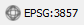
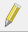
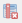
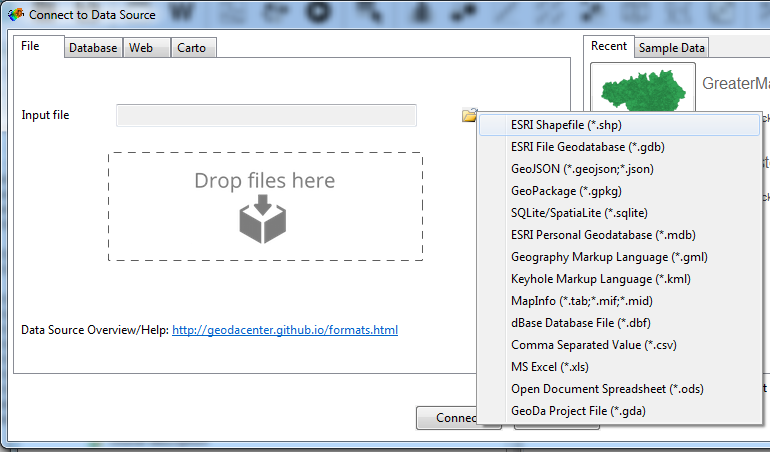
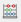

<!-- complied with pandoc -V geometry:margin=0.8in workbook.md -s -o workbook.pdf -->

# Confident Spatial Analysis in QGIS

## Practical 1: Recap of QGIS and Choropleth Maps

We are going to start with a quick recap of QGIS, including loading data, joining data and creating a choropleth map. Create a folder in Documents where you can save files relating to your GIS practical. 

- Download the data from `bit.ly/qgisprac1`.  
- Unzip the files and save them in the folder for this practical.  
- Open **QGIS** and use the **Add Vector Layer** { height=20 } to add `world-countries.shp`.  

We are now going to join some tabular data (populations) to our spatial data. If you are unsure about anything, please do ask, but we should be covering material you are already familiar with, so it should run smoothly!

- To add our table to the map click the **Add Vector Layer** { height=20 } and **Browse** to the files.  
- Select `pop2015.xls` (if it doesn’t show, change the box next to File Name from `ESRI Shapefiles` to `All files`).  
- Click **Open**, and click **Open** again to add the table of updated population data to the map project.  
- Right-click on the table we have just added (`pop2015`) and **Open Attribute Table** to check that the data appears correctly (if you have all `<null>` values, there has been a problem importing your data, try  adding it again).  
- Now we will join this table layer with your spatial data. Right-click on the `world_countires` layer, select **Properties** and click on the **Joins option**.  
- Click on the plus button to create a new join.  
- Make sure that `pop2015` is selected in the **Join layer** dropdown box.  
- `Name` should be selected in the **Join field** dropdown box.  
- `NAME` should also be selected in the **Target field** dropdown box.  
- Click **OK** and check that the 2015 population data have appeared correctly.  

The join that we have made is not permanent; it is a temporary link between the two datasets. To make the Join permanent we need to save a new copy of the `world_countries` layer.

- Right-click `world_countries` and click on **Save as**.  
- In the Save vector layer as window make sure that **Format** is set to `ESRI Shapefile`.  
- Save the new layer as `world_countries_updated` in the prac1 folder (click Browse to select the folder and enter the filename).  
- Check the checkbox next to **Add saved file to map**.  
- Hit **OK** and the new layer will be added to the map.  
- Open the attribute table to check that the new field (potentially shortened to `pop2015_PO`) is present.  

Now our data is in, and joined to our spatial data, we can create a choropleth map. Remember how important the classification process is - which classification method we choose can have a big impact on the map we create. 

- Open the **Layer Properties** window and the **Style** tab of the `world_countries_updated` layer.  
- Where the option says **Single symbol** at the top, change this to **Graduated**.  
- Select the `pop2015_PO` field from the column drop-down list.  
- The click **Classify**, you will see the 5 classes for this data set appear in the window.  
- Click **Apply** or **OK**, and QGIS will update the map. 

If you get to the end of the recap, and are happy with what we have covered, please carry on with Practical 2. If some thins are unclear, then please ask for help. 

--------------------------------------------------------------------  

## Practical 2: Swansea & Cardiff: Crime, House Prices & Flooding

Create a new folder in Documents where you can save files relating to this GIS practical. It is important to have good file management when using GIS, as we can end up creating lots of files very quickly!

- Open up **QGIS**.  
- Install the **QuickMapServices** plugin by selecting **Plugins > Manage and Install Plugins...**  
- Type `quick` in the search box at the top of the screen, and select **QuickMapServices**.  
- Click **Install plugin**.  
- The plugin should install reasonably quickly.  
- Once it is installed, close the plugins window and add the OSM Basemap by selecting **Web > QuickMapServices > OSM > OSM Standard**.  
- The OSM basemap should appear. Try zooming in to the UK, and note how the map updates.  

By default, the OSM Standard basemap uses the WGS84 / Pseudo Mercator projection. Most of the data we will be using will be in British National Grid. QGIS can automatically re-project GIS data if it knows what the coordinate system is. QGIS has a 'Project CRS' which is what the data are shown in the main window. Currently this is set to **EPSG:3857** (WGS 84 / Pseudo Mercator). 

- Click on the CRS symbol { height=20 } at the bottom right hand side of the QGIS window.  
- If it is not already checked, check the **Enable 'on the fly' CRS transformation (OTF)** box. This allows QGIS to automatically re-project spatial data.  
- Type `27700` in the **Filter** box and select **OSGB 1936 / British National Grid** - **EPSG:27700**.  
- Click **OK**. Now QGIS will re-project everything to British National Grid (27700). *You will start to remember the numbers soon!*   

Now we need to download some crime data for the South Wales force. 

- Go to `https://data.police.uk/` and click the **Data** tab at the top of the page.  
- Select the **South Wales Police** checkbox and click **Generate File**.  
- Click **Download now** to download the data. It will come in a zip file. Exract the file from this and save it in your practical folder. My version was called `2017-11-south-wales-street.csv`.  
- Open the file in Excel to have a look at the data we are using.  
- In QGIS, click **Layer > Add Layer > Add Delimited Text Layer…** and click **Browse** and select the `2017-11-south-wales-street.csv` file.  
- You should see the different columns appear at the bottom of the window.  
- Make sure that File format is set to **CSV** and Geometry definition is set to **Point coordinates**.  
- Check that X field is set to **Longitude** and Y field is set to **Latitude**. QGIS *should* do this automatically.  
- Click **OK**.  
- QGIS will ask what coordinate system the coordinates are in. Make sure Coordinate Reference System **WGS 84 – Authority ID EPSG:4326** is selected (type the ID number 4326 in the filter box if needed), and click **OK**.  
- Click **OK**.  

This will add the crime points to the map. Have they appeared where you would expect?

It is also helpful to have the Force Boundary data in here, as we will need this later on.

- Go back to the website and click on the **Data** tab, select **Boundaries** and download the **Force boundaries** file.  
- Extract the files from here, and save the `south-wales.kml` file in your practical folder.  
- Add this to QGIS using the **Add Vector Layer** { height=20 } tool.  
- Adjust the symbology to show the area as an outline.  

We are now going to add some House Price Paid data. You can download the data from `https://www.gov.uk/government/`
`statistical-data-sets/price-paid-data-downloads`, but this is a national dataset, so I have extracted the data for South Wales, and prepared it for you. 

<!-- I have extracted the data for south Wales, but the only geographic information that is provided is postcodes. Therefore we need to join some coordinate data to it, in order to plot it on the map. 

- Open up the `south-wales-house-prices-pp-2017.csv` file and have a look at the data. Notice we have the postcode, price, a range of other columns, but no coordinates. 

get them to do join? -->

Download the data from `http://bit.ly/csaqhouse`. Extract the files, and add the `south-wales-house-prices-ppd-2017.shp` to QGIS.  

You might notice that the area the crime data covers doesn't match the area the house price data covers. This is often common when combining different data sources, so it is good practice to reduce your data down to the area you are interested in. 

- Click **Processing > Toolbox**.  
- Type `clip` in the search box.  
- Select **QGIS geoalgorithims > Vector overlay tools > Clip**.  
- Set **Input layer** to `south-wales-house-prices-ppd-2017`.  
- Set **Clip layer** to `south-wales`.  
- You will notice we get an error message - this is because the CRS's are different. We need to reproject the crime data to BNG.  

- Right click on the `south-wales` layer and choose **Save As...**.  
- Save the file as `south-wales-police-force-bng.shp`.  
- Change **CRS** to **Project CRS (EPSG:27700)**.  
- Now repeat the clip process.  
- Click **Processing > Toolbox**.  
- Select **QGIS geoalgorithims > Vector overlay tools > Clip**.  
- Set **Input layer** to `south-wales-house-prices-ppd-2017`.  
- Set **Clip layer** to `south-wales`.  
- This will tidy-up the data. We now need to save it, as currently it is only in a temporary layer.  
- Right click on `Clipped` layer and choose Save As..  
- Set Format to **ESRI Shapefile**.  
- Save clipped layer as `south-wales-house-prices-bng.shp`.  

Now we have some House Price data, try classifying it.  

- Right click on `south-wales-house-prices-bng`, choose **Properties**.  
- Set to **Graduated**, select **Price** as the column and click **Classify**.  
- You will see a range of dots, but they are probably all in the same class.   
- Have a look at the values for properties. What are they? (You can click on the field in the Attribute Table to sort the table by that variable).  

### Removing Outliers (optional exercise)

How could you refine the data? Have a look at the data values,and think about what points might you need to remove. 

### Aggregating Data

Whilst having the point data is ok, we are quite limited with how we might be able to look at patterns. One way of looking at patterns is to group the data together into a larger geography. There are lots of potential options and this time we are going to group data to a ward level. This will then allow us to compare the number of crimes and average house prices for each ward. 

You can download a whole range of boundary data from Ordnance Survey Open Data. We will be using a set of ward data from their Boundary Line product. 

- Go to `https://www.ordnancesurvey.co.uk/opendatadownload/products.html`.  
- Scroll down to **Boundary Line** and select the checkbox for **Download**.  
- Scroll down to the bottom and click **Continue**.  
- Fill in the details and OS will send you an email with a link to download the data.  *(If you can't access your email, a copy of the data is available on the GitHub site, community_ward_region.zip)*.  
- Download the zip file, and extract the file `community_ward_region` from **Data > Wales**. Remember we need all 4 files as it is a shape file with multiple parts! 
- Add `community_ward_region.shp` to QGIS.  

Now we are going to group the data within each ward. First, we will use **Point-in-Polygons** to count how many crimes were reported in each ward. 

- Click **Processing > Toolbox**.  
- Type `point` in the search box.  
- Select **QGIS geoalgorithims > Vector analysis tools > Count points in polygons**.  
- Set **Polygons** to `community_ward_region`.  
- Set **Points** to `south-wales-police-force-bng`.  
- We may get an error message about CRS. Check which CRS the data are in (in the square brackets). If they are different we can change it.  
- With this data, they are in the correct CRS, but QGIS hasn't interpreted it correctly.   
- Right click on `community_ward_region` layer and choose **Properties**.  
- Under **General**, change **Coordinate reference system** to **Project CRS (EPSG:27700)**.  
- Click **OK** and rerun the analysis:  
- Click **Processing > Toolbox**.  
- Type `point` in the search box.  
- Select **QGIS geoalgorithims > Vector analysis tools > Count points in polygons**.  
- Set **Polygons** to `community_ward_region`.  
- Set **Points** to `south-wales-police-force-bng`.  
- Check the count layer has come out correctly - you should have some values in the rows.  
- If so, save this as a new layer (`wards_crime.shp`).  

All of the wards in Wales have shown up! See if you can use the `clip` tool to remove the ones we don't need - use the instructions above as a starting point. 

We can do the same process with house prices, but here we are not just interested in the number of houses sold (which **Count points in polygons** would give us) but the average house price. We can calculate this using a tool called **Join attributes by location**.

It is good practice to try and keep the data in our attribute table to a minimum. 

- Right click on the `south-wales-house-prices` layer and choose **Save As.** to create a copy.  
- Remove all columns from this apart from the `Price` column. To do this, open the Attribute Table, click **Edit** { height=20 } and then choose **Delete Field** { height=20 }.  
- Highlight and remove all the fields apart from `Price`.  
- Click the **Edit** icon, and save your edits.  

Now we can run the analysis.

- Click **Processing > Toolbox**.  
- Search for `Join attributes by location` and double-click on it.  
- Set **Target vector layer** to `wards_crime`.  
- Set **Join vector layer** to `south-wales-house-prices-bng`.  
- For **Geometric predicate** select `intersects` *(this is the relationship between the target and join layers)*.  
- Change **Attribute summary** to `Take summary of intersecting features`.  
- Leave **Statistics for summary** as it is (although it might be worth thinking about what we actually want from the data).  
- Click **Run**.  
- This will create a layer of the wards, and calculate the average (both mean and median) house prices that fall within each ward.  
- Export the layer as `wards_crime_house_prices.shp`.  

*For reasons best known to itself, QGIS may decide to store the price data in the northings set of columns, particularly if you don't remove the additional columns. If the price data look odd, try exploring different columns.*

It would be interesting to look at the relationship between each layer. It's not easy to create scatter plots of data i QGIS, so we can use a different piece of software (GeoDa) to look at this. 

- Click **Start > GeoDa**.  
- When GeoDa opens, click on the folder icon (see screenshot).  
- Select **ESRI Shapefile (.shp)**.  
- Browse to and open **wards_crime_house_prices.shp**.  

{ height=40% }

GeoDa should open a map display of the data automatically. We can create a simple choropleth map in here by right clicking on the map and then select **Change Current Map Type**. Select **Natural Breaks > 5** and choose the variable to map (we want **IMDscore**). Then a classified map will appear, similar to one we have created in QGIS. 

Also open the attribute table { height=20 } and a histogram { height=20 } for `Price`. GeoDa allows us to use brushing or linked displays. Select one of the larger bars in the histogram and you will see that the same entries are highlighted on the map and in the attribute table. You can also draw a box on the map (left-click and drag) and that will highlight the entries as well (you can drag the box around). 

We can also create scatter plots with two different variables. Have an explore and try the different options.

*How is this different to interacting with the data in QGIS/ArcGIS? Is it better / easier to use? Or harder to use?*

### Flood Data (optional exercise)

We also have some data on flooding that we can add to the map. Download the data in GeoJSON format from `http://lle.gov.wales/catalogue/item/FloodMapAreasBenefitingFromFloodDefences/?lang=en` and add it in to QGIS.

How might we go about looking at how flood risk influences house prices? See if you can adapt the method we used earlier to incorporate the flooding data into the analysis. 

-----------------------------------------------------------------------	

## Practical 3: Cardiff: LSOAs, IMD & Greenspace

- Open up **QGIS**.  
- Go to `http://census.edina.ac.uk/` and select Boundary Data Selector.  
- Then set Country to **Wales**, Geography to **Statistical Building Block**, dates to **2011 and later**, and click **Find**.  
- Select **Welsh Lower Layer Super Output Areas, 2011** and click **List Areas**.  
- Select **Cardiff** from the list and click **Extract Boundary Data**.  
- Click **BoundaryData.zip** and save this to your working folder.  
- Extract and add this shapefile to QGIS.  

This is going to be a framework we can store our data in. One of the first bits of information we will add is IMD, a measure of deprivation. The higher rank (e.g. 1) is the most deprived. 

- Go to `https://statswales.gov.wales/Catalogue/Community-Safety-and-Social-Inclusion/`
`Welsh-Index-of-Multiple-Deprivation/WIMD-2014/wimd2014`.  
- Click **Export**.  
- Leave **Export type** as **Comma separated**.  
- Click **Start Export**.  
- Download the file, and save it into your practical folder.  

*If you have trouble accessing the data, it is on the GitHub website, `wales-imd-export.csv`*

It's good practice to have a look at the details. 

- Open file in **Excel**.  
- We need to tidy it up a bit, before we read it in to QGIS.  
- Delete the first 6 rows.  
- Delete column A.  
- Insert a new column between column A and column B.  
- Select the new column A (starting `W01000001: Aberffraw & Rhosneigr 1`).  
- Click **Data > Text to Columns...**.  
- We should have a column with just the codes in it (e.g `W01000001`).  
- Label this column as `code`.  
- The entires in column A may have some stray spaces in them at the end of the code.  
- If they do, use **Find & Replace** to replace the spaces with nothing.  
- Save the data as a CSV file.   

*If you have trouble processing the data or want to see what it looks like, it is on the GitHub website, `wales-imd-export-prepared.csv`*

Add the CSV file to QGIS using the **Add Delimited Test layer** option like we did before. After you have selected the file, make sure you select **No geometry** option, as we are only adding an attribute table.  

Now join the data to the LSOA data set. Right click on the LSOA data set, and choose **Properties**. Then under **Join**, and select the table we have just added. Join the two together using the LSOA code.  

Plot the IMD data and flip the colours to the order is more logical. Value 4 is the most deprived and 1907 is the least deprived. You can also update the legend text to say which is most and least deprived.  

Now we have our deprivation data, we might want to see how it compares with a range of other data sets.  

One dataset we can add is bus stops. The full dataset is available at `https://data.gov.uk/dataset/naptan`, but again it is a national data set, so I have downloaded it and processed it for you. Download the data from `http://bit.ly/csapbus`. When the CSV file opens in your web browser, choose **File > Save as** to save the file as a CSV file.  

- Use **Add Delimited Text layer..** to add the `stops_cardiff.csv` data file.  
- This data has two sets of coordinates - WGS84 (latitude and longitude) and BNG (eastings and northings). Set **X** to **Eastings** and **Y** to **Northings** and make sure you set the CRS as British National Grid (27700) when you are prompted for it. After you have loaded the layer in, rename to `stops_cardiff`.  

- Click **Processing > Toolbox**.  
- Type `point` in the search box.  
- Select **QGIS geoalgorithims > Vector analysis tools > Count points in polygons**.  
- Set **Polygons** to `wales_lsoa_2011`.  
- Set **Points** to `stops_cardiff`.  
- Click **Run**.  
- Right click and save layer as `count-bus-stops-lsoa.shp`.  
- Open the **Attribute table**.  

If you scroll to the right hand side of the attribute table, this lists the number of bus stops within each LSOA. We could look to see if there is any relationship between the number of bus stops and other factors - e.g. the IMD level in this case. 

In QGIS 2.x there aren't any very easy options for creating a scatter plot. It is probably easiest to export the file as a CSV file (right-click, Save As > CSV) and create one in Excel. Another very useful tool for this type of analysis is GeoDa. 

### Analysis in GeoDa (optional exercise)

Using the instructions above, try opening the data in GeoDa and exploring it, using the instructions we have covered already. 

### Working with Greenspace Data

We are now going to add some greenspace data, and see how that varies across each LSOA. 

- Go to: `www.ordnancesurvey.co.uk/opendatadownload/products.html`.  
- Select the **ST tile** for **OS Open Greenspace**.  
- Leave supply format as **GML 3**.  
- Click **Continue**.  
- Fill in details and you will be emailed a link.  

Like with the crime data, our greenspace data covers a larger area than we need. Try clipping the data using the tools we used before, and save the layer as `clipped-greenspace`. 

We can use the dissolve tool to get a total amount of area:

- Open the **Dissolve** tool (from **Processing > Toolbox**).  
- Select the **greenspace** layer.  
- Click **Run**.  
- Open the attribute table to view the output.  
- Turn on Editing by clicking the **Edit** button ({ height=20 }) and click **Add Column** ({ height=20 }).  
- Set the **Name** to `area`.  
- Set **Type** to `Decimal number (real)`.  
- Set **Length** to `10` and **Prevision** to `4`.  
- Click **OK**.  
- Click **Field Calculator** ({ height=20 }).  
- Choose **Update existing field** and set to `Area`.  
- Expand **Geometry** and double-click `$area`. This will add the area in square meters (as our coordinate system is BNG).  
- This should come out at `11,403,399.5` (m) and we can divide this by 10,000 to get 1,140 hectares.  
- Note this is a temporary layer, so when we close QGIS, it won't be saved.  

Repeat the process for LSOA area which should come out at `149,498,246.2` square meters, i.e. 14,949.8 hectares. 

So overall the proportion of greenspace area is 1140 / 14949 = 0.0762 = 7.6%. 

### Spatial Overlay - Greenspace and LSOAs

We can do a similar process to see what proportion of each LSOA is greenspace. 

- Firstly, we need the area of each LSOA. Add a new field (called `lsoa_area`) and set it to real (length `10`, precision `3`).  
- Use field calculator to add the area to the new field, as we did previously.  

We will be combining the layers using the Union tool, and we need to do some preparation for this. 

- Add a new column in the greenspace layer called `greenspace` set to **Whole number (integer)** and use field calculator to set all the entires in this column to `1`.  
- Find and open the **Union** tool in the **Processing Toolbox**.  
- Set the **Input layer** to `wales_lsoa_2011`.  
- Set the **Input layer 2** to `clipped-greenspace`.  
- Click **Run** and check the output. You should have a layer with a polygon for each intersection of LSOAs and greenspace.  
- Save this as a new layer.  
- Add a new column called `area` and use **Field Calculator** to add the area to it.  

<!-- (We do have completely blank rows (with greenspace but no LSOA) but the area is 0. These are just the other combinations. ) ("greenspace"  IS BLANK AND  "code" IS BLANK) -->
 
Update the symbology of the LSOA layer to show it as an outline. 
 
Now we have an attribute table split by LSOA and greenspace. Within each LSOA we have one polygon that is non greenspace and 1 or more that are greenspace. We can merge so we have a dataset that lists each LSOA twice. 

- Make sure everything is de-selected (by clicking { height=20 })  
- Use the **Dissolve** tool from **Processing Toolbox**.  
- Set **Input** to `clipped-greenspace-lsoa-union`.  
- Untick **Dissolve all**.  
- Use the single `>` arrow to move **code** and **greenspace** to **Selected**.  
- **Run**.  
- Save as `dissolved-clipped-greenspace-lsoa-union.shp`.  
- Use **Select by attributes** to select the rows where `greenspace = 1` and save this as CSV a file called `greenspace-lsoa-pc.csv`. Remember to tick the **Save only selected features** checkbox.  
- In the CSV file, use **Field Calculator** to calculate the percentage of greenspace (`"area"  /  "lsoa-area" ) * 100`).  
- Check that the outputs are sensible, and if they are, join this back on to the LSOA layer, and then plot the percentage values on the map.  
- The LSOAs that are 'missing' have no greenspace within them.  
- If we wanted, we could plot the greenspace data with different colours if it is above or below the average.  

This gives us a nice output of the proportions of greenspace. We could perform a similar process, but with the greenspace buffered. This would be a proxy for 'accessible' green space. Try buffering the greenspace data at 300m, and repeat the process. 

### Healthyness Index (optional exercise)

There is another dataset we could add, the 'Healthyness Index' devepoled by the CDRC. Have a look at `https://data.cdrc.ac.uk/dataset/access-to-healthy-assets-and-hazards-ahah` and download the **AHAH Overall Index and Domains** data (you may need to sign up with CDRC to access this data). When working with this data, use the column headed **ahah** which is the main domain index, and is at the LSOA geography.  

*If you use the **Layer > Add Layer > Add Delimited Text** layer option, then QGIS is quite good at guessing the variable types correctly (string, integer or real). If you use **Add Vector Layer** to add data, then it assumes everything is a string - unless you create a CSVT file. For our AHAH index file, it would be called `ahahdomainsindex.csvt` and it would contain:
`"String","Integer","Integer","Integer","Integer","Real","Real","Real","Real"`*

			
  
    
    
    
    
-----------------------------------------------------------------------			

This practical was written using QGIS 2.18 and GeoDa 1.12 by Dr. Nick Bearman (nick@clearmapping.co.uk). Last updated 7 February 2018. 

This work is licensed under the Creative Commons Attribution-ShareAlike 4.0 International License. To view a copy of this license, visit http://creativecommons.org/licenses/by-sa/4.0/deed.en. The latest version of the PDF is available from https://github.com/nickbearman.  This practical is written in Markdown, and compiled using Pandoc 1.17.1, tested on Windows 7. 
			
			
			
			
			
			
